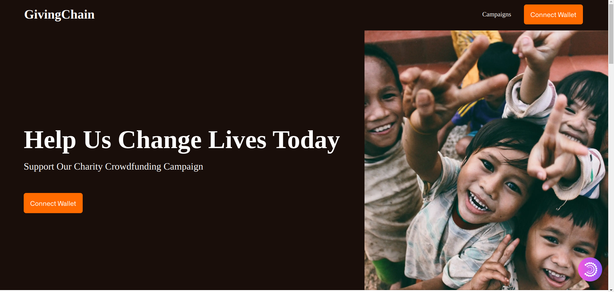

<!-- PROJECT SHIELDS -->
<!--
*** I'm using markdown "reference style" links for readability.
*** Reference links are enclosed in brackets [ ] instead of parentheses ( ).
*** See the bottom of this document for the declaration of the reference variables
*** for contributors-url, forks-url, etc. This is an optional, concise syntax you may use.
*** https://www.markdownguide.org/basic-syntax/#reference-style-links
-->


[![Contributors][contributors-shield]][contributors-url]
[![GitHub issues][issues-shield]][issues-url]
[![GitHub forks][forks-shield]][forks-url]
[![GitHub stars][star-shield]][star-url]
[![GitHub license][license-shield]][license-url]


# Giving Chain 

### Brief Description
Giving Chain is a crowdfunding platform built on Binance smart chain. 
It allows users to easily support their favorite campaigns and causes with ease. 
With Giving Chain, Campaign owners can create and manage their campaigns, and have complete control over the funds raised. 
By leveraging the power of blockchain technology, Giving Chain ensures that every donation is secure, transparent, and immutable. Join us in revolutionizing the world of charitable giving with Giving Chain! This project is purely supported by tips given by donors when supporting a campaign.

### Use case

Giving Chain is to provide a decentralized and transparent crowdfunding platform that enables donors to easily support campaigns and causes, and for campaign owners to easily create and manage campaigns. This makes it an ideal platform for charities, non-profit organizations, and individuals who need to raise funds for a specific cause. The platform provides a great opportunity to revolutionize the world of charitable giving, and to make a real impact on the lives of people in need.

### Particle Network's SDK integration.

Particle Network's SDK was used to provide social login authentication functionality to the Giving Chain platform. This can be achieved by integrating with the social media platforms used by Giving Chain users, such as Facebook, Google, Discord, Github etc. The SDK can enable Giving Chain to securely authenticate users through these platforms, allowing users to easily and securely log in to the platform. This ensures that web2 users can easily interact with the platform.

Particle Network's SDK was also used to provide decentralized storage functionality to the Giving Chain platform. Giving Chain used the SDK to securely store data related to campaigns, such as images that describes the campaign, ensuring that the data is tamper-proof and transparent.

Integrating Particle Network's SDK, Giving Chain provides users with a secure and transparent crowdfunding platform that leverages the benefits of social login authentication and decentralized storage. 

#### **N/B**: All PRs should be made to the [staging](https://github.com/coolpythoncodes/Giving-Chain-Dapp/tree/staging) branch


This project was bootstrapped with [`create-t3-app`](https://create.t3.gg/).

## Technology Stack & Tools

- React
- NextJS
- Hardhat
- Solidity
- Particle network for social login authentication and decentralized storage.


### Install
```bash
git clone https://github.com/coolpythoncodes/Giving-Chain-Dapp

yarn install

# create a particle network project from https://dashboard.particle.network/#/project/all 
# to get PROJECT_ID, CLIENT_KEY, and SERVER_KEY

- Copy `.env.example` to a new `.env` file on Giving-Chain-Dapp root folder
- Copy `secret.example.json` to a new `secret.json` // ensure you don't expose this to the public
cd Giving-Chain-Dapp

#Get your web development server running.
yarn dev

# compile the contract at the root directory
npx hardhat compile

# deploy to bsc testnet
yarn deploy-testnet

```

## 🤝 Contributing

Contributions, issues, and feature requests are welcome!

Feel free to check the [issues page](../../issues/).

## Show your support

Give a ⭐ if you like this project!

## Demo images

> Landing Page



> Social login authentication with Particle Network


> List of campaigns


> Create a campaign


> View a campaign


> Donate to a campaign


## Useful links

- [BNB Faucet](https://testnet.bnbchain.org/faucet-smart)
- [Particle network](https://particle.network/)
- [BSC scan api key](https://bscscan.com/myapikey)
- [Verified Giving Chain Token address on BSC scan](https://testnet.bscscan.com/address/0x1A99D6C14c0fF2A0B5A6a3c1244862E2cDa45eC5#code)
- [Verified Crowd Fund address on BSC scan](https://testnet.bscscan.com/address/0xa95735fA11707298417e92D5963a6E3faF1c32c7#code)
- [Demo video](https://drive.google.com/file/d/1zfF8w1IYyeZDcCKGY0FbUymRmaGyfqck/view?usp=share_link)

[contributors-shield]: https://img.shields.io/github/contributors/coolpythoncodes/Giving-Chain-Dapp?style=for-the-badge
[contributors-url]: https://github.com/coolpythoncodes/Giving-Chain-Dapp/graphs/contributors
[issues-shield]: https://img.shields.io/github/issues/coolpythoncodes/Giving-Chain-Dapp?style=for-the-badge
[issues-url]: https://github.com/coolpythoncodes/Giving-Chain-Dapp/issues
[forks-shield]: https://img.shields.io/github/forks/coolpythoncodes/Giving-Chain-Dapp?style=for-the-badge
[forks-url]: https://github.com/coolpythoncodes/Giving-Chain-Dapp/network
[star-shield]: https://img.shields.io/github/stars/coolpythoncodes/Giving-Chain-Dapp?style=for-the-badge
[star-url]: https://github.com/coolpythoncodes/Giving-Chain-Dapp/stargazers
[license-shield]: https://img.shields.io/github/license/coolpythoncodes/Giving-Chain-Dapp?style=for-the-badge
[license-url]: https://github.com/coolpythoncodes/Giving-Chain-Dapp/blob/main/LICENSE.md
